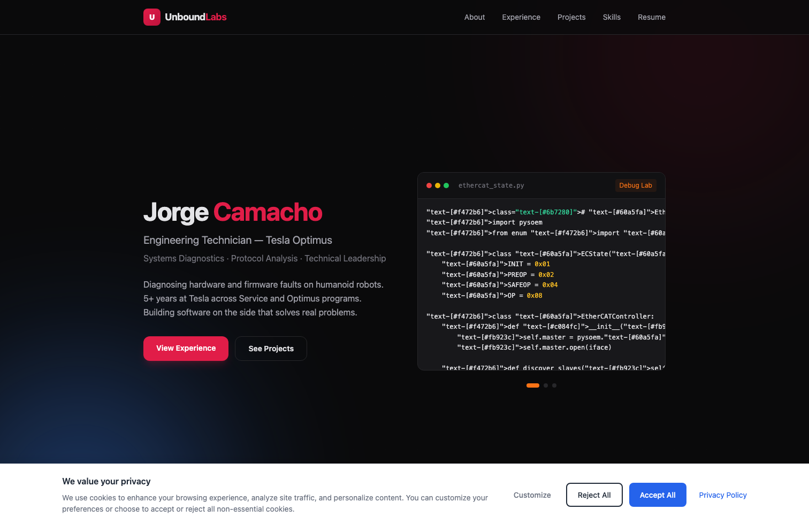
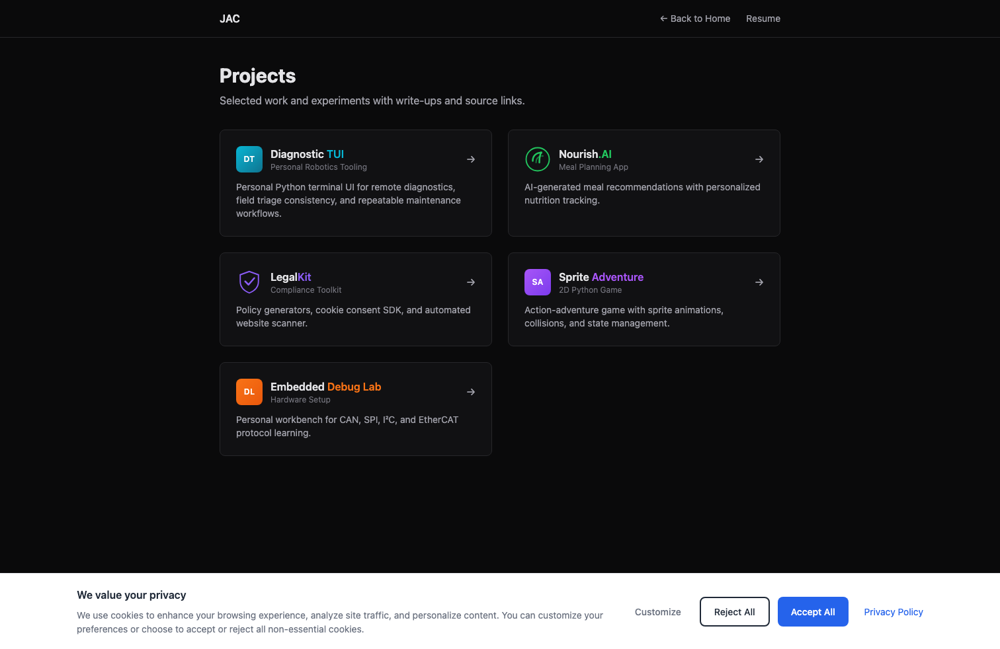
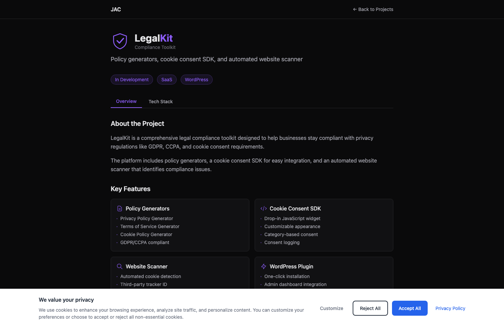

# Unbound Labs Showcase

Public landing-page showcase for my technical interests, career development system, and role-readiness work.

## Live Site
- Website: https://unbound-labs.com
- Goal: one organized place for my technical direction, progress, and professional narrative

## What This Represents
- A personal operating system for growth toward advanced diagnostics/field technical roles
- Structured development loop: practice -> artifacts -> review -> improvement
- Career-focused documentation that stays practical and execution-oriented

## Unbound Games Branch
- Branch: **Unbound Games**
- Current titles:
  - VillageCraft
  - SpriteAdventureBattle
- Supporting systems work:
  - cAVes1.01 (Unity world/village generation and demo tooling passes)
- Demo captures for these are being added next.

## Demo Shots
### Landing Page

### Projects Overview

### Project Detail (LegalKit)

## Focus Areas
- Electrical and embedded diagnostics (CAN, LIN, EtherCAT)
- Linux-based troubleshooting and tooling
- Scope + DMM signal validation and fault isolation
- Python and SQL for trend analysis and repeat issue reduction
- Clear technical documentation and escalation communication

## Notes
- This public repo is intentionally **showcase-only**.
- Implementation source code is kept private.

## Contact
- LinkedIn: https://www.linkedin.com/in/jorge-camacho-286343195/
- GitHub: https://github.com/posei21
